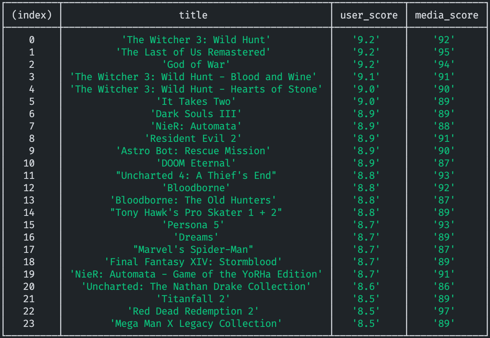

# Find the best metacritic games

## so many games and so little time

You might want to spend your time on the "best games" out there which'll worth it. Nowadays, I find neither media review score or user review score on the metacritic site is a reliable indicator for a "good game". Due to marketing and various reasons, a game could have a high media score but still feels boring or broken, while a high user score sometimes can be boosted by certain niche fans. But if a game scores high on both, it most likely will be a pretty decent one. So I write this tool to help find these games.

### how to use

1. If you don't use [Volta](https://volta.sh/), make sure you have [Node.js](https://nodejs.org/) installed. Run `npm i` first.
2. In a terminal app, run `npm start`. It will prompt you to select a platform first. (Allow network if Chromium asks for it.) The tool then shows you the games that score both more than 85 for media review and more than 8.5 for user review. You can modify the score criteria in the code.

   For example, as of June 24, 2021, these are the best PS4 games:
   
